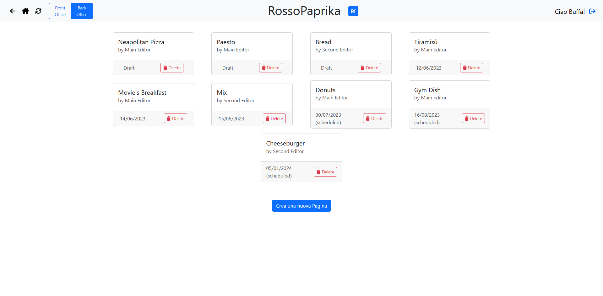

# Exam #1: "CMSmall"
## Student: s316999 BUFFA ALEXANDRO 

## React Client Application Routes

- Route `/`: Home page, contains the list of pages
- Route `/login`: login page
- Route `/pages/:id`: page with id `:id`, represents the complete page with all the blocks
- Route `/pages/new`: page for creating a new page.

## API Server

> Checkout the handy Swagger documentation for the API at [this localhost page](http://localhost:3001/api-docs)  

Base Path: `/api`

### Authentication API
- **POST** `/auth/login`
  - request: username, password
  - id, username, name, role
- **GET** `/auth/me`  
Endpoint to get the current logged in user
  - request: none (only session cookie)
  - response: same as login if logged, 401 otherwise
- **DELETE** `/auth/me`  
  Logout
  - request: none (only session cookie)
  - response: 200 if logged, 401 otherwise

### Site API
- **GET** `/meta/images`
  - request: none
  - response: array of images path and names
- **GET** `/meta/editors`
  - request: none
  - response: array of editors if requester is admin, 401 otherwise
- **GET** `/meta/name`
  - request: none
  - response: site name 
- **PUT** `/meta/name`
  - request: new site name
  - response: 200 if requester is admin, 401 otherwise

### Pages API
- **GET** `/pages`
  - request: none
  - response: array of PageHead (page without blocks), filtered to only published if not logged
- **GET** `/pages/:id`
  - request: id of the page
  - response: Page (page with blocks) if user allowed to see it, error otherwise
- **POST** `/pages`
  Create a new page
  - request: Page
  - response: Page if user allowed to create it
- **PUT** `/pages/:id`
  Update a page
  - request: id of the page, Page
  - response: Page if user allowed to update it, error if not or page is invalid
- **DELETE** `/pages/:id`
  Delete a page
  - request: id of the page
  - response: 200 if user allowed to delete it, error otherwise

## Database Tables

- Table `users` - contains id, email, name, salt, passwordHash, role
- Table `site` - contains id, name
- Table `pages` contains id, title, author_id, blocks, created_at, published_at 
- Table `blocks` contains id, type, content, page_id, order

## Main React Components

- `Header.jsx`: Site-wide header with login/logout buttons and navigation links (Home, back, reload)
- `TitleSite.jsx` embedded in Header, allows to edit site name whenever the user is admin
- `Page` (in `Page.jsx`): Component handling all the page logic, both viewing and editing. Splitted into `PageMetadata` and a list of `Block`.
- `EditableBlock` in `Block.jsx`, allows to edit a single block
- `DeleteButton` in `DeleteButton.jsx`, before deleting anything requires double click, with intuitive popover to explain what's going on

## Screenshot

## Users Credentials

| Name | Username | Password | Role | Drafts | Published | Scheduled |
|---|---|---|---|---|---|---|
| Buffa | buffa@test.com | password | admin | 0 | 0 | 0 |
| Main Editor | editor1@test.com | password | editor | 2 | 2 | 2 |
| Second Editor | editor2@test.com | password | editor | 1 | 1 | 1 |
| Pageless Editor | editor3@test.com | password | editor | 0 | 0 | 0 |
| Useless User | user4@test.com | password | user | 0 | 0 | 0 |
